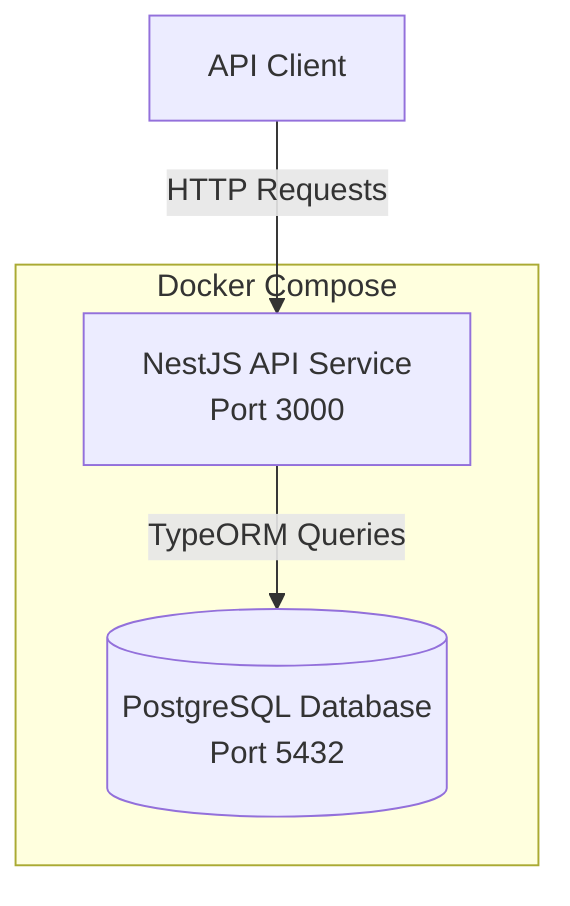
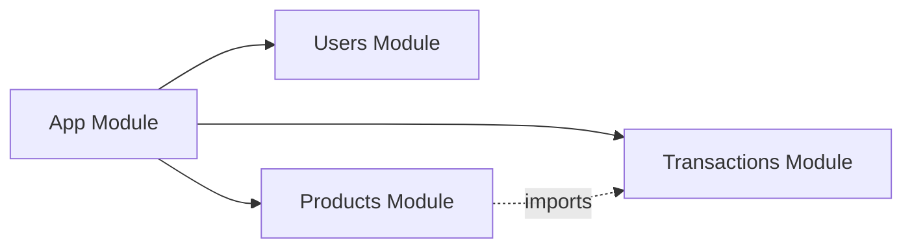
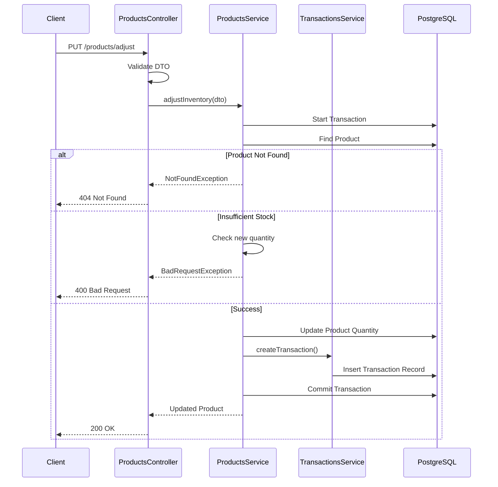

# Design Document

## Overview

The Inventory Management API is a containerized NestJS application that provides RESTful endpoints for managing users, products, and inventory transactions. The system uses TypeORM for database operations with PostgreSQL as the data store. The architecture follows NestJS best practices with clear separation of concerns through modules, controllers, services, and DTOs.

The application is designed to be stateless, with all state persisted in PostgreSQL. Docker Compose orchestrates both the API and database services, ensuring easy deployment and consistent environments across development and production.

## Architecture

### High-Level Architecture



### Module Architecture



### Request Flow for Inventory Adjustment



## Components and Interfaces

### 1. Users Module

**Purpose:** Manages user creation and validation.

**Components:**
- `UsersController`: Handles HTTP requests for user operations
- `UsersService`: Contains business logic for user management
- `User Entity`: TypeORM entity representing the users table
- `CreateUserDto`: Validates incoming user creation requests

**Key Methods:**
```typescript
// UsersController
@Post()
create(@Body() createUserDto: CreateUserDto): Promise<User>

// UsersService
async create(createUserDto: CreateUserDto): Promise<User>
```

### 2. Products Module

**Purpose:** Manages product creation, inventory adjustments, and status queries.

**Components:**
- `ProductsController`: Handles HTTP requests for product operations
- `ProductsService`: Contains business logic for product and inventory management
- `Product Entity`: TypeORM entity representing the products table
- `CreateProductDto`: Validates product creation requests
- `AdjustInventoryDto`: Validates inventory adjustment requests

**Key Methods:**
```typescript
// ProductsController
@Post()
create(@Body() createProductDto: CreateProductDto): Promise<Product>

@Put('adjust')
adjustInventory(@Body() adjustDto: AdjustInventoryDto): Promise<Product>

@Get('status/:id')
getStatus(@Param('id', ParseUUIDPipe) id: string): Promise<ProductStatusDto>

// ProductsService
async create(createProductDto: CreateProductDto): Promise<Product>
async adjustInventory(adjustDto: AdjustInventoryDto): Promise<Product>
async findOne(id: string): Promise<Product>
```

**Design Decision:** The `adjustInventory` method uses TypeORM's `QueryRunner` to manage database transactions, ensuring atomicity between product quantity updates and transaction record creation.

### 3. Transactions Module

**Purpose:** Records and retrieves inventory transaction history.

**Components:**
- `TransactionsController`: Handles HTTP requests for transaction queries
- `TransactionsService`: Contains business logic for transaction management
- `Transaction Entity`: TypeORM entity representing the transactions table
- `CreateTransactionDto`: Internal DTO for creating transaction records
- `PaginationDto`: Validates pagination parameters

**Key Methods:**
```typescript
// TransactionsController
@Get()
findAll(@Query() paginationDto: PaginationDto): Promise<PaginatedTransactionsDto>

// TransactionsService
async create(createTransactionDto: CreateTransactionDto): Promise<Transaction>
async findAll(paginationDto: PaginationDto): Promise<PaginatedTransactionsDto>
```

### 4. Global Configuration

**Components:**
- `ConfigModule`: Manages environment variables with validation using Joi
- `TypeOrmModule`: Configures database connection and migration settings
- `ValidationPipe`: Global pipe for DTO validation using class-validator

## Data Models

### User Entity

```typescript
@Entity('users')
export class User {
  @PrimaryGeneratedColumn('uuid')
  id: string;

  @Column({ length: 100 })
  name: string;

  @Column({ unique: true })
  email: string;
}
```

**Constraints:**
- `id`: UUID primary key
- `email`: Unique constraint enforced at database level
- `name`: Maximum length of 100 characters

### Product Entity

```typescript
@Entity('products')
@Check('"quantity" >= 0')
export class Product {
  @PrimaryGeneratedColumn('uuid')
  id: string;

  @Column({ length: 100, unique: true })
  name: string;

  @Column({ type: 'int', default: 0 })
  quantity: number;

  @OneToMany(() => Transaction, (transaction) => transaction.product)
  transactions: Transaction[];
}
```

**Constraints:**
- `id`: UUID primary key
- `name`: Unique constraint enforced at database level
- `quantity`: Non-negative integer enforced by CHECK constraint
- Relationship: One-to-many with Transaction entity

### Transaction Entity

```typescript
export enum TransactionType {
  INBOUND = 'INBOUND',
  OUTBOUND = 'OUTBOUND',
}

@Entity('transactions')
export class Transaction {
  @PrimaryGeneratedColumn('uuid')
  id: string;

  @Column({ type: 'uuid' })
  productId: string;

  @Column({ type: 'enum', enum: TransactionType })
  type: TransactionType;

  @Column({ type: 'int' })
  quantityChanged: number;

  @CreateDateColumn({ type: 'timestamp' })
  timestamp: Date;

  @ManyToOne(() => Product, (product) => product.transactions, {
    onDelete: 'CASCADE',
  })
  @JoinColumn({ name: 'productId' })
  product: Product;
}
```

**Constraints:**
- `id`: UUID primary key
- `productId`: Foreign key to Product entity with CASCADE delete
- `type`: Enum restricted to 'INBOUND' or 'OUTBOUND'
- `timestamp`: Automatically set on creation

### DTOs

#### CreateUserDto
```typescript
export class CreateUserDto {
  @IsString()
  @IsNotEmpty()
  @MaxLength(100)
  name: string;

  @IsEmail()
  @IsNotEmpty()
  email: string;
}
```

#### CreateProductDto
```typescript
export class CreateProductDto {
  @IsString()
  @IsNotEmpty()
  @MaxLength(100)
  name: string;

  @IsInt()
  @Min(0)
  @IsOptional()
  quantity?: number;
}
```

#### AdjustInventoryDto
```typescript
export class AdjustInventoryDto {
  @IsUUID()
  productId: string;

  @IsInt()
  @IsNotEmpty()
  changeAmount: number; // Positive for inbound, negative for outbound
}
```

#### PaginationDto
```typescript
export class PaginationDto {
  @IsInt()
  @Min(1)
  @IsOptional()
  @Type(() => Number)
  page?: number = 1;

  @IsInt()
  @Min(1)
  @Max(100)
  @IsOptional()
  @Type(() => Number)
  limit?: number = 10;
}
```

## Error Handling

### Exception Strategy

The application uses NestJS built-in exception filters and custom exceptions to provide consistent error responses.

**Standard HTTP Exceptions:**
- `BadRequestException` (400): Validation errors, business rule violations
- `NotFoundException` (404): Resource not found
- `InternalServerErrorException` (500): Unexpected errors

### Error Response Format

All errors follow a consistent structure:

```json
{
  "statusCode": 400,
  "message": "Validation failed",
  "error": "Bad Request",
  "details": [
    {
      "field": "email",
      "message": "email must be a valid email"
    }
  ]
}
```

### Specific Error Scenarios

1. **Duplicate Email/Product Name:**
   - Catch TypeORM `QueryFailedError` with code '23505' (unique violation)
   - Return 400 with message: "Email/Product name already exists"

2. **Insufficient Stock:**
   - Check if `product.quantity + changeAmount < 0` before update
   - Return 400 with message: "Insufficient stock. Available: X, Requested: Y"

3. **Product Not Found:**
   - Return 404 with message: "Product with ID {id} not found"

4. **Invalid UUID:**
   - Handled by `ParseUUIDPipe` in controller
   - Return 400 with message: "Validation failed (uuid is expected)"

### Transaction Rollback

When using TypeORM transactions for inventory adjustments:
- Any error during the transaction automatically triggers a rollback
- Both product quantity update and transaction record creation are atomic
- Database remains consistent even if the application crashes mid-operation

## Testing Strategy

### Unit Tests

**Scope:** Test individual service methods in isolation using mocked repositories.

**Key Test Cases:**

1. **UsersService:**
   - Create user with valid data
   - Handle duplicate email error
   - Validate DTO constraints

2. **ProductsService:**
   - Create product with default quantity
   - Create product with initial quantity
   - Adjust inventory (inbound)
   - Adjust inventory (outbound)
   - Reject adjustment causing negative quantity
   - Handle product not found
   - Verify transaction atomicity (mock QueryRunner)

3. **TransactionsService:**
   - Create transaction record
   - Retrieve paginated transactions
   - Verify product relationship is loaded

**Tools:** Jest with TypeORM repository mocks

### Integration Tests (E2E)

**Scope:** Test complete request-response cycles with a real test database.

**Key Test Cases:**

1. **User Endpoints:**
   - POST /users with valid data returns 201
   - POST /users with duplicate email returns 400
   - POST /users with invalid email returns 400

2. **Product Endpoints:**
   - POST /products creates product with quantity 0
   - POST /products with initial quantity
   - POST /products with duplicate name returns 400
   - GET /status/:id returns product details
   - GET /status/:id with invalid ID returns 404

3. **Inventory Adjustment:**
   - PUT /products/adjust increases quantity (inbound)
   - PUT /products/adjust decreases quantity (outbound)
   - PUT /products/adjust rejects negative quantity
   - Verify transaction record is created
   - Verify atomicity (simulate failure scenarios)

4. **Transaction History:**
   - GET /transactions returns paginated results
   - GET /transactions with custom pagination
   - Verify transactions include product names
   - Verify transactions are ordered by timestamp DESC

**Tools:** Jest with Supertest, test PostgreSQL database

### Test Database Strategy

- Use a separate test database (e.g., `inventory_db_test`)
- Run migrations before tests
- Clear data between test suites
- Use transactions for test isolation where possible

## Infrastructure and Deployment

### Docker Compose Configuration

**Services:**

1. **postgres:**
   - Image: `postgres:16-alpine`
   - Environment: Database credentials
   - Volume: `postgres_data` for persistence
   - Health check: `pg_isready` command
   - Port: 5432 (exposed for local development)

2. **api:**
   - Build: From Dockerfile in project root
   - Environment: Database connection variables, PORT
   - Depends on: postgres (with health check condition)
   - Port: 3000 (mapped to host)
   - Restart policy: `unless-stopped`

### Dockerfile Strategy

**Multi-stage build:**

1. **Builder stage:**
   - Base: `node:20-alpine`
   - Install all dependencies (including devDependencies)
   - Build TypeScript to JavaScript

2. **Production stage:**
   - Base: `node:20-alpine`
   - Install only production dependencies
   - Copy compiled code and migrations
   - Expose port 3000
   - CMD: `node dist/main`

**Design Decision:** Multi-stage builds reduce final image size by excluding devDependencies and source TypeScript files.

### Migration Strategy

**Automatic Migration on Startup:**
- `migrationsRun: true` in TypeORM configuration
- Migrations execute before the application accepts requests
- Ensures database schema is always up-to-date

**Manual Migration Commands:**
```bash
npm run migration:generate -- src/migrations/MigrationName
npm run migration:run
npm run migration:revert
```

### Environment Variables

Required variables:
- `DB_HOST`: Database host (default: localhost)
- `DB_PORT`: Database port (default: 5432)
- `DB_USERNAME`: Database user (default: postgres)
- `DB_PASSWORD`: Database password (required)
- `DB_NAME`: Database name (default: inventory_db)
- `PORT`: API port (default: 3000)

Validation: Joi schema in ConfigModule ensures all required variables are present.

## Design Decisions and Trade-offs

### 1. Synchronize vs. Migrations

**Decision:** Use migrations (`synchronize: false`)

**Rationale:**
- Migrations provide version control for schema changes
- Safer for production environments
- Explicit control over schema evolution
- Required by assignment specifications

**Trade-off:** Requires manual migration generation, but provides better control and safety.

### 2. Transaction Management for Inventory Adjustments

**Decision:** Use TypeORM QueryRunner for explicit transaction control

**Rationale:**
- Ensures atomicity between product update and transaction record creation
- Prevents partial updates if either operation fails
- Provides clear rollback semantics

**Trade-off:** Slightly more complex code, but critical for data consistency.

### 3. Validation Strategy

**Decision:** Use class-validator with DTOs and global ValidationPipe

**Rationale:**
- Declarative validation rules
- Automatic error response generation
- Type safety with TypeScript
- Consistent validation across all endpoints

**Trade-off:** Requires DTO classes for all requests, but provides robust validation.

### 4. Pagination Implementation

**Decision:** Page-based pagination (page + limit)

**Rationale:**
- Simple and intuitive for API consumers
- Sufficient for the assignment requirements
- Easy to implement with TypeORM's `skip` and `take`

**Trade-off:** Not suitable for very large datasets (cursor-based pagination would be better), but adequate for typical inventory systems.

### 5. Error Handling for Duplicate Keys

**Decision:** Catch database errors and transform to HTTP exceptions

**Rationale:**
- Provides user-friendly error messages
- Hides internal database error details
- Consistent with REST API best practices

**Trade-off:** Requires error code checking (e.g., PostgreSQL error code 23505), but improves API usability.

### 6. Transaction History Query

**Decision:** Include product name via JOIN, order by timestamp DESC

**Rationale:**
- Reduces client-side requests (no need to fetch product details separately)
- Most recent transactions are typically most relevant
- TypeORM relations make this efficient

**Trade-off:** Slightly more complex query, but significantly better user experience.

### 7. Product Quantity Constraint

**Decision:** Enforce non-negative quantity at both application and database levels

**Rationale:**
- Database CHECK constraint provides last line of defense
- Application-level check provides better error messages
- Defense in depth approach

**Trade-off:** Duplicate validation logic, but ensures data integrity.

## Assumptions

1. **Concurrency:** The application assumes moderate concurrency. For high-concurrency scenarios, optimistic locking or row-level locking would be needed.

2. **Authentication:** No authentication or authorization is implemented. In production, endpoints would require authentication.

3. **Soft Deletes:** Products and users are hard-deleted. Soft deletes would be preferable for audit purposes.

4. **Transaction History:** All transactions are retained indefinitely. In production, archival or retention policies might be needed.

5. **Quantity Units:** Product quantities are unitless integers. Real systems would need unit tracking (e.g., kg, liters, pieces).

6. **Single Currency/Location:** The system assumes a single inventory location. Multi-warehouse scenarios would require additional modeling.

7. **Performance:** The design prioritizes correctness and simplicity over performance. For large-scale systems, caching and query optimization would be necessary.
